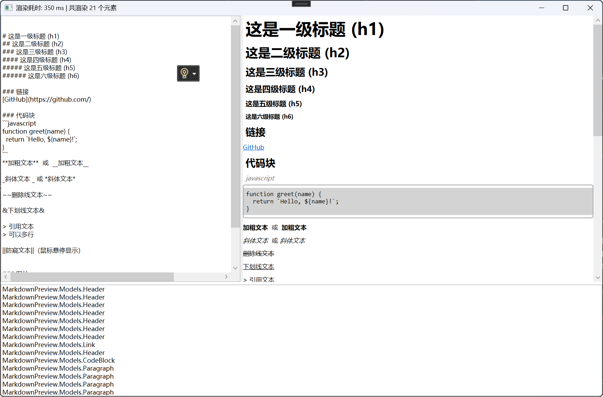
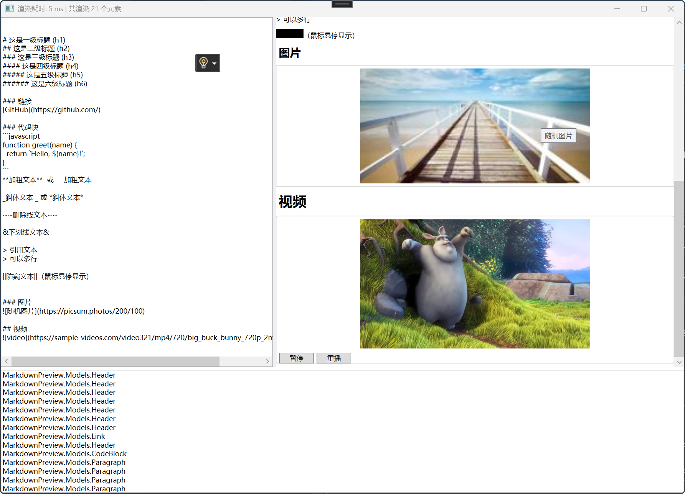

# MarkdownPreview
* 一个将Markdown解析为Json并用WPF原生组件渲染的Demo
* A demo that parses Markdown to Json and renders it with WPF native components

# 截图 | Screenshots

# 使用的开源项目 | Open Source Projects Used
* [Newtonsoft.Json](https://www.newtonsoft.com/json)